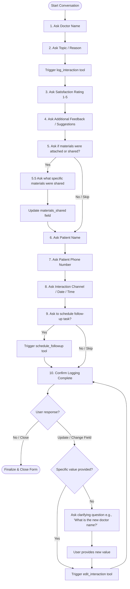

<div align="center">

# 🧬 Aivoa CRM

### AI-First CRM for Life Sciences Field Representatives

[](https://fastapi.tiangolo.com/)
[](https://react.dev/)
[](https://langchain-ai.github.io/langgraph/)
[](https://groq.com/)
[](LICENSE)

*Log HCP interactions via smart conversational AI or a structured form — in one unified workspace.*

</div>

---

## 📋 Table of Contents

- [Overview](#-overview)
- [Features](#-features)
- [Tech Stack](#-tech-stack)
- [Architecture](#-architecture)
- [AI Agent & Tools](#-ai-agent--tools)
- [API Reference](#-api-reference)
- [Getting Started](#-getting-started)
- [Usage Walkthrough](#-usage-walkthrough)
- [Project Structure](#-project-structure)
- [Configuration](#-configuration)

---

## 🔭 Overview

**Aivoa CRM** is an AI-first Customer Relationship Management system purpose-built for Life Sciences and pharmaceutical field representatives. It provides a dual-interface **Log Interaction Screen** that empowers reps to log meetings with Healthcare Professionals (HCPs) in two complementary ways:

- **🤖 AI Chat Assistant** — Paste raw, unstructured field notes into a conversational interface. A LangGraph agent automatically parses intent, extracts product mentions, scores sentiment, logs the interaction, schedules follow-ups, and drafts a follow-up email — all in a single message.
- **📋 Structured Form** — A traditional, field-by-field logging form for precision data entry, with dropdowns for channel, sentiment, product tags, and rich notes.

Both interfaces sync to the same SQLite backend, keeping HCP profiles, interaction timelines, and follow-up task boards always up to date.

---

## ✨ Features

| Feature | Description |
|---|---|
| **HCP Directory** | Browse, select, and view doctor profiles including clinic, specialty, contact info, and recent sentiment |
| **AI Chat Logging** | Conversational interface powered by a LangGraph state-machine agent |
| **Structured Form Logging** | Multi-field form with channel selection, product tagging, sentiment scoring, and rich notes |
| **Interaction Timeline** | Chronological log of all past meetings with edit capability |
| **Follow-Up Scheduler** | Task board for scheduling and tracking pending/completed follow-up actions |
| **AI Email Drafting** | Auto-generated follow-up email drafts in a dedicated side panel |
| **Sentiment Tracking** | Per-HCP sentiment automatically updated on every logged interaction |
| **Demo Seed Data** | One-click database seeding with 4 HCPs, 5 drug products, and sample interactions |
| **Offline Fallback Mode** | Smart regex-based mock agent runs when no Groq API key is provided |

---

## 🛠️ Tech Stack

### Frontend
| Technology | Version | Purpose |
|---|---|---|
| [React](https://react.dev/) | 19 | UI component framework |
| [Vite](https://vitejs.dev/) | 8 | Build tool & dev server |
| [Redux Toolkit](https://redux-toolkit.js.org/) | 2.12+ | Async state management |
| [Lucide React](https://lucide.dev/) | 1.24+ | Icon library |
| Vanilla CSS | — | Glassmorphic dark-mode design system |

### Backend
| Technology | Version | Purpose |
|---|---|---|
| [FastAPI](https://fastapi.tiangolo.com/) | 0.100+ | REST API framework |
| [Uvicorn](https://www.uvicorn.org/) | — | ASGI server |
| [SQLAlchemy](https://www.sqlalchemy.org/) | — | ORM & database management |
| [SQLite](https://www.sqlite.org/) | — | Local relational database |
| [LangGraph](https://langchain-ai.github.io/langgraph/) | 0.0.32+ | AI agent state-machine orchestration |
| [LangChain Core](https://python.langchain.com/) | 0.1.38+ | LLM abstraction layer |
| [langchain-groq](https://python.langchain.com/docs/integrations/chat/groq) | — | Groq LLM integration |
| [Pydantic](https://docs.pydantic.dev/) | — | Data validation & serialization |
| [python-dotenv](https://pypi.org/project/python-dotenv/) | — | Environment variable management |

---

## 🏗️ Architecture

```
┌─────────────────────────────────────────────────────────────────┐
│                        FRONTEND (React 19 + Vite)               │
│                                                                  │
│  ┌──────────────┐  ┌──────────────┐  ┌───────────────────────┐  │
│  │ HcpSelector  │  │ ChatInterface│  │   InteractionForm     │  │
│  │   (sidebar)  │  │  (AI chat)   │  │  (structured form)   │  │
│  └──────┬───────┘  └──────┬───────┘  └──────────┬────────────┘  │
│         │                 │                       │              │
│         └─────────────────┴───────────────────────┘             │
│                           │                                      │
│               Redux Toolkit (crmSlice)                           │
└───────────────────────────┼──────────────────────────────────────┘
                            │ HTTP REST (fetch)
┌───────────────────────────▼──────────────────────────────────────┐
│                    BACKEND (FastAPI + Uvicorn)                    │
│                                                                   │
│  /api/hcps   /api/products   /api/interactions   /api/tasks       │
│                         /api/chat ──────────────────┐            │
│                                                     ▼            │
│                                          LangGraph Agent         │
│                                        ┌─────────────────────┐   │
│                                        │  get_hcp_profile    │   │
│                                        │  log_interaction    │   │
│                                        │  edit_interaction   │   │
│                                        │  schedule_followup  │   │
│                                        │  generate_email     │   │
│                                        └──────────┬──────────┘   │
│                                                   │              │
│                                     Groq LLM (gemma2-9b-it)      │
│                                     or Regex Mock Fallback        │
└───────────────────────────────────────────────────┬──────────────┘
                                                    │
                                               SQLite DB
                                     (hcps / products / interactions
                                          / follow_up_tasks)
```

---

## 🤖 AI Agent & Tools

The **LangGraph agent** is a stateful state-machine that orchestrates tool calls when a rep submits unstructured field notes. When a `GROQ_API_KEY` is configured, it uses Groq's `gemma2-9b-it` model. Without a key, it falls back to a smart pattern-matching regex engine.

### 🔄 Conversational Survey Flowchart

The conversational AI assistant collects patient feedback and updates the CRM form step-by-step using the following workflow:



The agent has access to **5 custom tools**:

### 1. `get_hcp_profile`
Fetches the doctor's profile (clinic, address, email, specialty) and their recent interaction and task history to provide context to the LLM.

### 2. `log_interaction`
Parses raw meeting notes to:
- Summarize the discussion
- Score sentiment (`Positive` / `Neutral` / `Negative`)
- Tag pharmaceutical products mentioned
- Create a new interaction log entry

### 3. `edit_interaction`
Modifies an existing logged interaction — update channel, notes, sentiment, or product tags.

### 4. `schedule_followup`
Registers a new follow-up task for the HCP with a description and due date (e.g., "Mail brochures next Friday").

### 5. `generate_followup_email`
Drafts a professional, context-aware follow-up email based on the meeting notes, displayed in the AI Email Draft side panel.

---

## 📡 API Reference

The backend exposes a fully documented interactive API at `http://localhost:8000/docs` (Swagger UI).

| Method | Endpoint | Description |
|---|---|---|
| `GET` | `/` | Health check |
| `POST` | `/api/seed` | Seed demo data (HCPs, products, interactions, tasks) |
| `GET` | `/api/hcps` | List all Healthcare Professionals |
| `POST` | `/api/hcps` | Create a new HCP |
| `GET` | `/api/products` | List all pharmaceutical products |
| `GET` | `/api/interactions` | List interactions (optionally filter by `?hcp_id=`) |
| `POST` | `/api/interactions` | Log a new interaction |
| `PUT` | `/api/interactions/{id}` | Update an existing interaction |
| `GET` | `/api/tasks` | List follow-up tasks (optionally filter by `?hcp_id=`) |
| `POST` | `/api/tasks` | Create a follow-up task |
| `PUT` | `/api/tasks/{id}` | Update task status |
| `POST` | `/api/chat` | Send a message to the AI agent |

---

## 🚀 Getting Started

### Prerequisites

- **Python** 3.10 or higher
- **Node.js** 18+ and **npm**

---

### 1. Clone the Repository

```bash
git clone https://github.com/vaibhavvvv7/Aivoa-AI-CRM.git
cd Aivoa-AI-CRM
```

---

### 2. Backend Setup

```bash
# Navigate to the backend directory
cd backend

# Install Python dependencies
pip install -r requirements.txt
```

**Configure environment variables:**

```bash
# Copy the example env file (or edit .env directly)
# backend/.env
GROQ_API_KEY=your-actual-groq-key-here
```

> **Note:** The `GROQ_API_KEY` is optional. If omitted, the application automatically runs in **Mock Fallback Mode**, simulating agent tool calls using a smart regex parser — perfect for offline evaluation and demos.
>
> Get a free Groq API key at [console.groq.com](https://console.groq.com).

**Start the FastAPI server:**

```bash
python -m uvicorn app.main:app --reload --port 8000
```

The API will be live at `http://localhost:8000`.
Interactive docs available at `http://localhost:8000/docs`.

---

### 3. Frontend Setup

```bash
# In a new terminal, navigate to the frontend directory
cd frontend

# Install dependencies
npm install

# Start the Vite development server
npm run dev
```

Open your browser and navigate to `http://localhost:5173`.

---

## 🗺️ Usage Walkthrough

### Step 1 — Seed the Database
Click the **"Seed Demo Data"** button in the top-left corner of the UI. This populates the SQLite database with:
- **4 HCPs**: Dr. Sarah Jenkins (Cardiology), Dr. Alex Mercer (Neurology), Dr. Elena Rostova (Oncology), Dr. Marcus Vance (Endocrinology)
- **5 Products**: Lipitor, Zestril, Nexium, Keytruda, Gilenya
- Sample interaction logs and follow-up tasks

---

### Step 2 — AI Conversational Logging
Select **Dr. Sarah Jenkins** from the HCP directory. Go to the **AI Chat Assistant** tab and paste:

> *"Just finished a virtual call with Dr. Jenkins today. We discussed Nexium efficacy profiles. She was happy with the safety guidelines and requested printed brochures. Let's schedule a task next Friday to mail them."*

The agent will automatically:
1. ✅ Parse the unstructured text
2. ✅ Detect the **Virtual** channel and tag **Nexium** as the discussed product
3. ✅ Score sentiment as **Positive** and update the HCP profile card
4. ✅ Call `log_interaction` and refresh the Interaction Timeline
5. ✅ Call `schedule_followup` to create a brochure mailer task for next Friday
6. ✅ Call `generate_followup_email` and render a draft email in the side panel

---

### Step 3 — Structured Form Logging
Switch to the **Structured Logging Form** tab. Fill in the channel, notes, product tags, and sentiment manually, then click **Log Interaction** to verify manual data entry.

---

### Step 4 — Edit an Interaction
In the **Interaction Timeline**, click **"Edit Log"** on any card. Modify the notes, change the channel or sentiment, and click **Save Changes**. Verify that the timeline and the HCP sentiment indicator update in real time.

---

### Step 5 — Follow-Up Action Board
View the **Follow-Up Scheduler** column to see all pending tasks. Toggle the checkbox on any task to mark it **Completed**, or create new tasks manually.

---

## 📁 Project Structure

```
Aivoa-AI-CRM/
├── backend/
│   ├── app/
│   │   ├── __init__.py
│   │   ├── main.py          # FastAPI app, all REST endpoints
│   │   ├── models.py        # SQLAlchemy ORM models (HCP, Product, Interaction, FollowUpTask)
│   │   ├── schemas.py       # Pydantic request/response schemas
│   │   ├── database.py      # SQLAlchemy engine & session factory
│   │   ├── config.py        # App configuration & env loading
│   │   └── agent.py         # LangGraph AI agent & 5 tool definitions
│   ├── .env                 # Environment variables (GROQ_API_KEY)
│   ├── requirements.txt     # Python dependencies
│   ├── verify_backend.py    # Backend integration test script
│   └── crm.db               # SQLite database file (auto-created)
│
├── frontend/
│   ├── src/
│   │   ├── components/
│   │   │   ├── HcpSelector.jsx       # HCP directory sidebar
│   │   │   ├── ChatInterface.jsx     # AI conversational chat panel
│   │   │   ├── InteractionForm.jsx   # Structured interaction logging form
│   │   │   ├── HistoryView.jsx       # Interaction timeline with edit modal
│   │   │   └── FollowUpTasks.jsx     # Follow-up task board
│   │   ├── store/
│   │   │   ├── crmSlice.js           # Redux slice (all async thunks & state)
│   │   │   └── index.js              # Redux store configuration
│   │   ├── App.jsx                   # Root component & layout
│   │   ├── index.css                 # Global design system (glassmorphic dark theme)
│   │   └── main.jsx                  # React entry point
│   ├── index.html
│   ├── vite.config.js
│   └── package.json
│
├── crm.db                   # Root-level SQLite database (alternate)
├── .gitignore
└── README.md
```

---

## ⚙️ Configuration

| Variable | Location | Description | Required |
|---|---|---|---|
| `GROQ_API_KEY` | `backend/.env` | API key for Groq LLM (`gemma2-9b-it` model). Falls back to mock mode if absent. | No |

---

## 🧩 Data Models

### HCP (Healthcare Professional)
| Field | Type | Description |
|---|---|---|
| `id` | Integer | Primary key |
| `name` | String | Doctor's full name |
| `specialty` | String | Medical specialty |
| `clinic_name` | String | Clinic / hospital name |
| `email` | String | Contact email |
| `phone` | String | Contact phone |
| `address` | String | Clinic address |
| `recent_sentiment` | String | Latest sentiment: `Positive`, `Neutral`, `Negative` |

### Interaction
| Field | Type | Description |
|---|---|---|
| `id` | Integer | Primary key |
| `hcp_id` | Integer | FK → HCP |
| `date` | DateTime | Interaction timestamp |
| `channel` | String | `Face-to-Face`, `Virtual`, `Phone`, `Email` |
| `notes` | Text | Raw meeting notes |
| `summary` | Text | LLM-generated summary |
| `sentiment` | String | LLM-derived sentiment |
| `next_steps` | Text | Follow-up actions identified |
| `products_discussed` | String | Comma-separated product names |

### FollowUpTask
| Field | Type | Description |
|---|---|---|
| `id` | Integer | Primary key |
| `hcp_id` | Integer | FK → HCP |
| `description` | String | Task description |
| `due_date` | Date | Task deadline |
| `status` | String | `Pending`, `Completed`, `Cancelled` |

---

<div align="center">

Built with ❤️ for Life Sciences field teams · Powered by LangGraph & Groq

</div>
